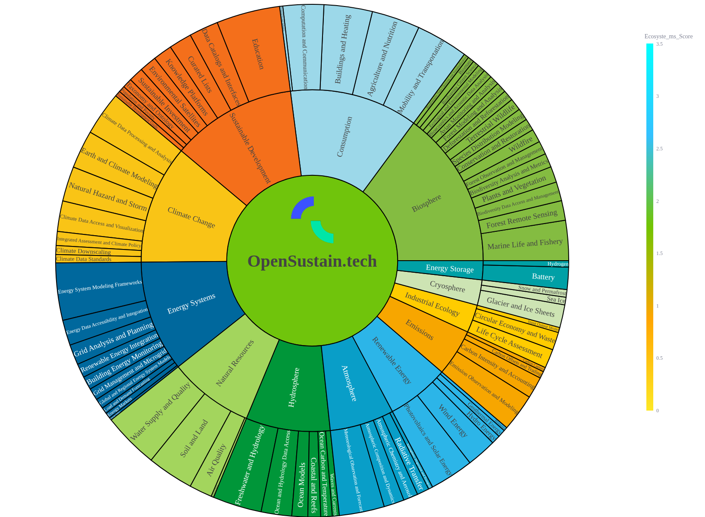

#  OpenSustain.tech Analytics Dashboard

[](https://www.python.org/)
[](https://streamlit.io)
[](LICENSE)

**OpenSustain Analytics** is an interactive **Streamlit dashboard** that visualizes and explores the open-source ecosystem for **climate and sustainability technologies**.  
It provides insight into project activity, community engagement, and metadata across hundreds of sustainability-related open-source repositories.

See a live Dashboard at: [Opensustain-analytics.streamlit.app](https://opensustain-analytics.streamlit.app/)

---



---

## 🚀 Features

- **🌎 Sustainability Ecosystem (Sunburst)**  
  Interactive visualization of the open sustainability landscape — from categories down to individual projects.

- **📈 Age vs. Sub-Category (Scatter Plot)**  
  Displays project age distribution across sub-categories, with bubble sizes representing contributor counts.

- **🏆 Download Ranking**  
  Ranks the most-downloaded open-source sustainability packages.

- **📊 Project Rankings**  
  Sort projects by contributors, commits, citations, stars, and Ecosyste.ms scores.

- **🏅 Leaderboard**  
  Multi-metric leaderboard comparing projects across multiple indicators.

- **📊 Categorical Distributions**  
  Shows distributions for licenses, programming languages, presence of contributing guides, codes of conduct, and ecosystems.

---

##  Data Fields

The dashboard uses a dataset called `projects.csv` with the following columns:

| Field | Description |
|--------|-------------|
| `project_names` | Project name |
| `git_url` | GitHub or GitLab repository URL |
| `description` | Short summary of the project |
| `homepage` | Project homepage |
| `category` | High-level topic (e.g., Energy, Water, Climate) |
| `sub_category` | More specific area (e.g., Solar PV, Air Quality) |
| `language` | Main programming language |
| `license` | Open-source license |
| `contributors` | Number of contributors |
| `stars` | GitHub stars |
| `downloads_last_month` | Download counts |
| `total_commits` | Total commits |
| `citations` | Number of citations |
| `score` | Ecosyste.ms score |
| `dds` | Development Distribution Score |
| `ecosystems` | Ecosystem or community tag |
| `code_of_conduct` | Whether the project has a Code of Conduct |
| `contributing_guide` | Whether the project has a contributing guide |
| `readme_image_urls` | Comma-separated URLs of images extracted from README files |

---

##  Installation

1. **Clone the repository**
   ```bash
   git clone https://github.com/protontypes/opensustain.analytics
   cd opensustain.analytics
   ```

2. **Install dependencies**
    ```bash
    pip install -r requirements.txt
    ```
3. **Add your data**
    Place your projects.csv and organization.csv file in the project directory.

4. **Run the Streamlit app**
    ```bash
    python3 -m streamlit run streamlit-app-tab.py
    ```

